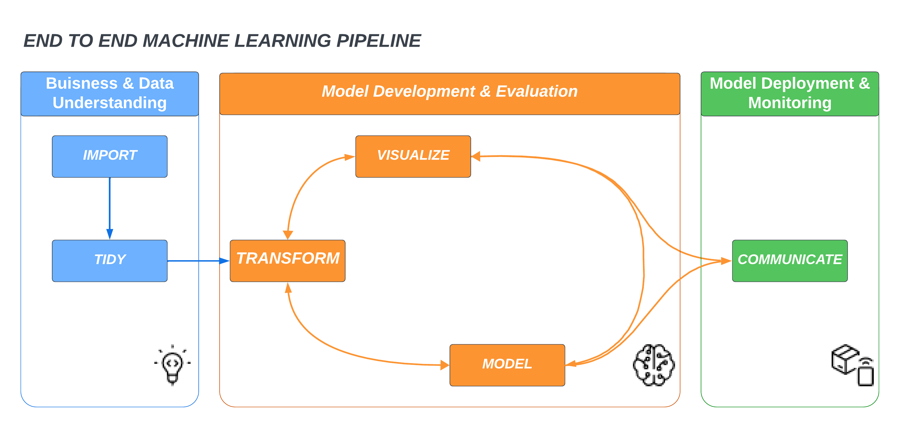
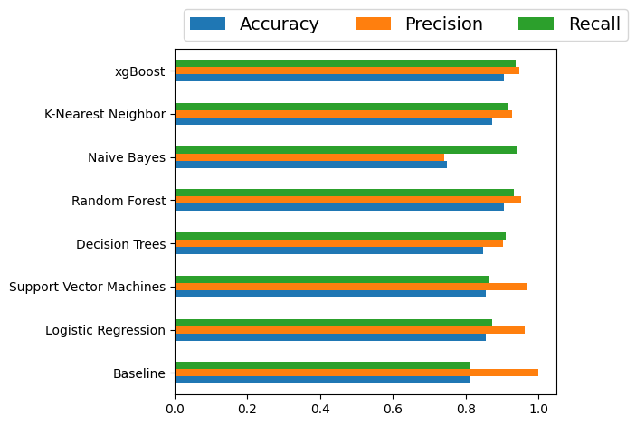
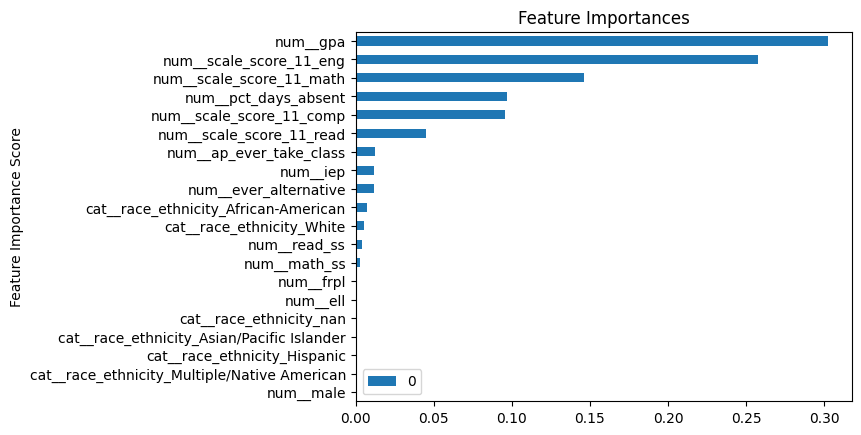

# 🎓 POC Early Warning System

[](https://www.python.org/downloads/)
[](https://github.com/astral-sh/uv)
[](https://streamlit.io)
[](https://xgboost.readthedocs.io/)
[](LICENSE)
[](https://github.com/astral-sh/ruff)
[](https://github.com/psf/black)

> **Individualized Student Graduation Risk Prediction using Machine Learning**

A comprehensive machine learning system that predicts high school graduation outcomes with 90.6% accuracy, providing actionable insights for early intervention and student support.

[Live Demo](https://rjw-data-poc-early-warning.streamlit.app) | [Documentation](#documentation) | [Report an Issue](https://github.com/rjwdata/poc-early-warning/issues)

---

## 📋 Table of Contents

- [Overview](#overview)
- [Key Features](#key-features)
- [Demo](#demo)
- [Installation](#installation)
- [Quick Start](#quick-start)
- [Usage](#usage)
- [Project Structure](#project-structure)
- [Model Performance](#model-performance)
- [Configuration](#configuration)
- [Development](#development)
- [Contributing](#contributing)
- [License](#license)
- [Acknowledgments](#acknowledgments)
- [Contact](#contact)

---

## 🎯 Overview

### The Problem

Traditional early warning systems use a **one-size-fits-all approach** with generic indicators:
- ❌ Attendance below 90%
- ❌ Number of D's and F's
- ❌ Suspension frequency

These methods lack specificity about **what students are at risk of**—graduation, college admission, or standardized test success.

### Our Solution

This system leverages **machine learning** to create **individualized risk indicators** that predict whether a student is at risk of not graduating from high school. The model analyzes:

- 📊 **16 predictive features** across multiple domains
- 🎯 **90.6% accuracy** in graduation prediction
- 🔄 **Real-time risk assessment** with interactive visualizations
- 📈 **Transparent reporting** with data and model quality metrics

---

## ✨ Key Features

### 🤖 Machine Learning Pipeline
- **End-to-end ML workflow** from data ingestion to deployment
- **Automated feature engineering** with robust preprocessing
- **Hyperparameter optimization** using Bayesian methods
- **Model versioning** and artifact management

### 📊 Interactive Web Application
- **Modern Streamlit interface** with professional UX design
- **Real-time predictions** with instant feedback
- **Interactive visualizations** using Plotly
- **Risk factor analysis** with actionable insights

### 🔍 Model Monitoring & Quality
- **Data quality reports** powered by Evidently AI
- **Model performance metrics** with comprehensive evaluation
- **Feature importance analysis** for interpretability
- **Automated testing** for data and model drift

### 🎨 User Experience
- **Intuitive sidebar** with organized input sections
- **Color-coded risk indicators** (green/yellow/red)
- **Personalized recommendations** based on risk level
- **Responsive design** for desktop and mobile

---

## 🖼️ Demo

### Prediction Interface


### Model Performance


### Feature Importance


**Live Application**: [https://rjw-data-poc-early-warning.streamlit.app](https://rjw-data-poc-early-warning.streamlit.app)

---

## 🚀 Installation

### Prerequisites

- Python 3.8 or higher
- Git
- [uv](https://github.com/astral-sh/uv) (recommended) or pip package manager

### Option 1: Using UV (⚡ Recommended - Fastest!)

[UV](https://github.com/astral-sh/uv) is an extremely fast Python package installer and resolver, written in Rust.

```bash
# Install uv (if not already installed)
# On macOS/Linux:
curl -LsSf https://astral.sh/uv/install.sh | sh
# On Windows:
powershell -c "irm https://astral.sh/uv/install.ps1 | iex"

# Clone the repository
git clone https://github.com/rjwdata/poc-early-warning.git
cd poc-early-warning

# Create virtual environment with uv
uv venv

# Activate virtual environment
# On Windows:
.venv\Scripts\activate
# On macOS/Linux:
source .venv/bin/activate

# Install dependencies (10-100x faster than pip!)
uv pip install -e .

# OR use Makefile for convenience
make install
```

### Option 2: Using UV with Make (🎯 Easiest!)

```bash
# Install uv and setup everything in one command
make setup-uv
make install-dev

# Run the application
make run-app
```

### Option 3: Standard Installation with pip

```bash
# Clone the repository
git clone https://github.com/rjwdata/poc-early-warning.git
cd poc-early-warning

# Create virtual environment
python -m venv venv

# Activate virtual environment
# On Windows:
venv\Scripts\activate
# On macOS/Linux:
source venv/bin/activate

# Install dependencies
pip install -e .
```

### Option 4: Using Conda

```bash
# Clone the repository
git clone https://github.com/rjwdata/poc-early-warning.git
cd poc-early-warning

# Create conda environment
conda create -n early-warning python=3.10
conda activate early-warning

# Install dependencies
pip install -e .
```

### 🎁 Benefits of Using UV

- ⚡ **10-100x faster** than pip
- 🔒 **Deterministic** dependency resolution
- 🎯 **Better error messages** and conflict resolution
- 📦 **Cross-platform** consistency
- 🚀 **No dependency on Python** for installation

---

## ⚡ Quick Start

### 1. Run the Prediction Application

**Using Make (Recommended):**
```bash
make run-app
```

**Or traditional method:**
```bash
uv run streamlit run app_pred.py
# OR with pip:
streamlit run app_pred.py
```

The application will open in your browser at `http://localhost:8501`

### 2. View Data & Model Quality Reports

**Using Make:**
```bash
make run-reports
```

**Or traditional method:**
```bash
uv run streamlit run app.py
```

Access quality reports at `http://localhost:8501`

### 3. Train the Model

**Using Make:**
```bash
make train
```

**Or traditional method:**
```bash
uv run python src/components/data_ingestion_eda.py
```

This will:
1. Load and preprocess the data
2. Train multiple classification models
3. Select the best performing model
4. Save artifacts to `artifacts/` directory
5. Generate quality reports

### 📋 Available Make Commands

```bash
make help          # Show all available commands
make install       # Install dependencies
make install-dev   # Install with dev dependencies
make test          # Run test suite
make lint          # Run linters
make format        # Format code
make clean         # Remove build artifacts
```

---

## 📖 Usage

### Making Predictions

#### Via Web Interface (Recommended)

1. Launch the application: `streamlit run app_pred.py`
2. Enter student information in the sidebar:
   - Demographics (gender, race/ethnicity, FRPL)
   - Support services (IEP, ELL, alternative school)
   - Academic performance (GPA, test scores, AP courses)
   - Attendance data
   - ACT scores
3. Click "🚀 Run Prediction Model"
4. View results with:
   - Prediction outcome (diploma/at-risk)
   - Graduation probability gauge
   - Risk factor analysis
   - Personalized recommendations

#### Via Python API

```python
from src.pipeline.predict_pipeline import PredictPipeline
import pandas as pd

# Prepare student data
student_data = pd.DataFrame([{
    'male': 'yes',
    'race_ethnicity': 'White',
    'frpl': 'no',
    'iep': 'no',
    'ell': 'no',
    'ever_alternative': 'no',
    'ap_ever_take_class': 'yes',
    'gpa': 3.5,
    'math_ss': 75,
    'read_ss': 72,
    'pct_days_absent': 5.0,
    'scale_score_11_comp': 24.0,
    'scale_score_11_eng': 23.0,
    'scale_score_11_math': 25.0,
    'scale_score_11_read': 24.0
}])

# Make prediction
pipeline = PredictPipeline()
prediction, probability = pipeline.predict(student_data)

print(f"Prediction: {'Diploma' if prediction[0] == 1 else 'At Risk'}")
print(f"Probability: {probability[0] * 100:.1f}%")
```

### Training a New Model

```python
from src.components.data_ingestion_eda import DataIngestion
from src.components.data_transformation import DataTransformation
from src.components.model_trainer import ModelTrainer

# Data ingestion
data_ingestion = DataIngestion()
train_path, test_path = data_ingestion.initiate_data_ingestion()

# Data transformation
data_transformation = DataTransformation()
train_arr, test_arr, _ = data_transformation.initiate_data_transformation(
    train_path, test_path
)

# Model training
model_trainer = ModelTrainer()
model_trainer.initiate_model_trainer(train_arr, test_arr)
```

---

## 📁 Project Structure

```
poc-early-warning/
│
├── 📂 artifacts/              # Trained models and preprocessors
│   ├── model.pkl              # Best trained model (XGBoost)
│   ├── preprocessor.pkl       # Fitted preprocessing pipeline
│   └── *.html                 # Quality reports
│
├── 📂 config/                 # Configuration files
│   └── params.yaml            # Model and pipeline parameters
│
├── 📂 data/                   # Data directories
│   ├── raw/                   # Raw source data
│   │   ├── train/             # Training data
│   │   └── test/              # Testing data
│   └── processed/             # Processed datasets
│
├── 📂 notebooks/              # Jupyter notebooks
│   ├── model_training.ipynb   # Model development notebook
│   └── model_card.ipynb       # Model documentation
│
├── 📂 src/                    # Source code
│   ├── components/            # ML pipeline components
│   │   ├── data_ingestion_eda.py
│   │   ├── data_transformation.py
│   │   ├── model_trainer.py
│   │   └── test_ingestion.py
│   ├── pipeline/              # Prediction pipeline
│   │   └── predict_pipeline.py
│   ├── static/                # Static assets (images, logos)
│   ├── config_loader.py       # Configuration management
│   ├── constants.py           # Project constants
│   ├── exception.py           # Custom exception handling
│   ├── logger.py              # Logging configuration
│   ├── ui.py                  # UI components for reports
│   └── utils.py               # Utility functions
│
├── 📂 reports/                # Generated reports
│
├── 📄 app_pred.py             # Prediction web application
├── 📄 app.py                  # Reports viewer application
├── 📄 pyproject.toml          # Modern Python project configuration
├── 📄 requirements.txt        # Python dependencies (pip compatible)
├── 📄 setup.py                # Legacy package setup
├── 📄 Makefile                # Development commands
├── 📄 .python-version         # Python version for UV
├── 📄 README.md               # This file
├── 📄 QUICKSTART.md           # Quick start guide
└── 📄 UV_GUIDE.md             # Detailed UV usage guide
```

---

## 📊 Model Performance

### Best Model: XGBoost Classifier

| Metric | Score |
|--------|-------|
| **Accuracy** | 90.64% |
| **Precision** | 94.68% |
| **Recall** | 93.86% |

### All Models Comparison

| Model | Accuracy | Precision | Recall |
|-------|----------|-----------|--------|
| **XGBoost** | **0.906** | **0.947** | **0.939** |
| Random Forest | 0.905 | 0.952 | 0.933 |
| K-Nearest Neighbor | 0.873 | 0.927 | 0.917 |
| Logistic Regression | 0.855 | 0.963 | 0.872 |
| Support Vector Machines | 0.854 | 0.971 | 0.866 |
| Decision Trees | 0.848 | 0.902 | 0.910 |
| Naive Bayes | 0.750 | 0.740 | 0.939 |
| Baseline | 0.813 | 1.000 | 0.813 |

### Dataset Information

- **Training Samples**: 42,353 students
- **Testing Samples**: 10,589 students
- **Features**: 15 predictive indicators
- **Target Variable**: `hs_diploma` (binary)
- **Class Distribution**: 81.2% graduated, 18.8% at-risk

### Features (16 Variables)

#### Demographics (3)
- `male` - Gender (binary)
- `race_ethnicity` - Racial/ethnic background (categorical)
- `frpl` - Free/Reduced Price Lunch status (binary)

#### Support Services (3)
- `iep` - Individualized Education Program participation
- `ell` - English Language Learner status
- `ever_alternative` - Alternative school enrollment history

#### Academic Performance (4)
- `gpa` - Cumulative GPA (0.0-4.0 scale)
- `math_ss` - Mathematics standardized score
- `read_ss` - Reading standardized score
- `ap_ever_take_class` - AP course participation

#### Attendance (1)
- `pct_days_absent` - Percentage of school days missed

#### Standardized Tests (4)
- `scale_score_11_eng` - 11th grade ACT English
- `scale_score_11_math` - 11th grade ACT Math
- `scale_score_11_read` - 11th grade ACT Reading
- `scale_score_11_comp` - 11th grade ACT Composite

#### Target (1)
- `hs_diploma` - High school diploma earned (0/1)

### Hyperparameter Tuning

Optimized using `hyperopt` with Bayesian optimization:

| Parameter | Value |
|-----------|-------|
| `colsample_bytree` | 0.7056 |
| `gamma` | 6.5289 |
| `max_depth` | 11 |
| `min_child_weight` | 7.0 |
| `reg_alpha` | 40.0 |
| `reg_lambda` | 0.0067 |
| `random_state` | 42 |

---

## ⚙️ Configuration

### Model Configuration (`config/params.yaml`)

```yaml
base:
  project: End-to-End-ML-Poc
  random_state: 67
  target_col: hs_diploma

models:
  logistic_regression: true
  svc: true
  decision_tree: true
  random_forest: true
  naive_bayes: true
  knn: true
  xgboost: true
```

### Environment Variables

Create a `.env` file (optional):

```bash
# Data paths
DATA_PATH=data/raw/data_2009.csv
MODEL_PATH=artifacts/model.pkl

# Logging
LOG_LEVEL=INFO
```

---

## 🛠️ Development

### Setting Up Development Environment

**Using Make (Recommended):**

```bash
# Install everything with development dependencies
make install-dev

# Setup pre-commit hooks
make setup-hooks

# Run all tests
make test

# Run linters
make lint

# Format code
make format

# Clean build artifacts
make clean
```

**Or using UV directly:**

```bash
# Install with dev dependencies
uv pip install -e ".[dev,test]"

# Setup pre-commit hooks
uv run pre-commit install

# Run tests
uv run pytest tests/

# Run linters
uv run ruff check src/
uv run black --check src/
uv run mypy src/

# Format code
uv run black src/
uv run ruff check --fix src/
```

**Traditional method (pip):**

```bash
pip install -e ".[dev,test]"
pre-commit install
pytest tests/
black src/
```

### Development Workflow

```bash
# 1. Create a new branch
git checkout -b feature/my-feature

# 2. Make your changes

# 3. Format and lint
make format
make lint

# 4. Run tests
make test

# 5. Commit changes
git add .
git commit -m "Add my feature"

# 6. Push and create PR
git push origin feature/my-feature
```

### Available Development Tools

Our `pyproject.toml` includes modern development tools:

- **Black**: Code formatting (100 char line length)
- **Ruff**: Fast Python linter (replaces Flake8, isort, etc.)
- **MyPy**: Static type checking
- **Pytest**: Testing framework with coverage
- **Pre-commit**: Git hooks for code quality

See [UV_GUIDE.md](UV_GUIDE.md) for detailed UV usage instructions.

### Project Architecture

The project follows a **modular ML pipeline architecture**:

1. **Data Ingestion**: Load and validate raw data
2. **Data Transformation**: Feature engineering and preprocessing
3. **Model Training**: Train multiple models and select the best
4. **Model Evaluation**: Comprehensive performance metrics
5. **Deployment**: Web application with real-time predictions

### Key Design Patterns

- **Factory Pattern**: Safe model instantiation without `eval()`
- **Pipeline Pattern**: Modular data processing workflow
- **Configuration Pattern**: Centralized YAML-based configuration
- **Singleton Pattern**: Shared configuration loading

### Code Quality

- **Type Hints**: Full type annotations throughout
- **Docstrings**: Comprehensive documentation
- **Logging**: Structured logging at all levels
- **Error Handling**: Custom exceptions with context
- **Testing**: Unit and integration tests (in development)

---

## 🤝 Contributing

We welcome contributions! Here's how you can help:

### Reporting Issues

- Use the [issue tracker](https://github.com/rjwdata/poc-early-warning/issues)
- Search existing issues before creating new ones
- Provide detailed reproduction steps
- Include system information and error messages

### Submitting Pull Requests

1. Fork the repository
2. Create a feature branch (`git checkout -b feature/amazing-feature`)
3. Make your changes
4. Add tests for new functionality
5. Ensure all tests pass
6. Commit with clear messages (`git commit -m 'Add amazing feature'`)
7. Push to your fork (`git push origin feature/amazing-feature`)
8. Open a Pull Request

### Development Guidelines

- Follow PEP 8 style guide
- Write comprehensive docstrings
- Add type hints to all functions
- Maintain test coverage above 80%
- Update documentation for new features

---

## 📄 License

This project is licensed under the MIT License - see the [LICENSE](LICENSE) file for details.

---

## 🙏 Acknowledgments

### Data Source
- **Strategic Data Project** - Center for Educational Policy Research, Harvard University
- Synthetic educational data for analytics research

### Technologies

#### Machine Learning
- **[XGBoost](https://xgboost.readthedocs.io/)** - Gradient boosting framework
- **[scikit-learn](https://scikit-learn.org)** - Machine learning library
- **[Evidently AI](https://evidentlyai.com)** - ML monitoring and quality

#### Web & Visualization
- **[Streamlit](https://streamlit.io)** - Web application framework
- **[Plotly](https://plotly.com)** - Interactive visualizations

#### Development Tools
- **[UV](https://github.com/astral-sh/uv)** - Ultra-fast Python package installer
- **[Ruff](https://github.com/astral-sh/ruff)** - Fast Python linter
- **[Black](https://github.com/psf/black)** - Python code formatter
- **[MyPy](https://mypy-lang.org/)** - Static type checker
- **[Pytest](https://pytest.org)** - Testing framework

### Research References
- Dropout prevention research from multiple educational institutions
- Early warning system literature and best practices
- Machine learning interpretability frameworks

---

## 📧 Contact

**Project Maintainer**: hawkeye
**Email**: project@example.com
**GitHub**: [@rjwdata](https://github.com/rjwdata)

### Support

- 📖 [Documentation](https://github.com/rjwdata/poc-early-warning/wiki)
- 💬 [Discussions](https://github.com/rjwdata/poc-early-warning/discussions)
- 🐛 [Issue Tracker](https://github.com/rjwdata/poc-early-warning/issues)
- 🌐 [Live Demo](https://rjw-data-poc-early-warning.streamlit.app)

---

## 🎯 Roadmap

### Current Version (v0.1.0)
- ✅ XGBoost model with 90.6% accuracy
- ✅ Interactive Streamlit web application
- ✅ Data and model quality monitoring
- ✅ Automated feature engineering
- ✅ Comprehensive documentation

### Future Enhancements
- [ ] **API Deployment**: REST API with FastAPI
- [ ] **Database Integration**: PostgreSQL for data storage
- [ ] **Batch Predictions**: Process multiple students
- [ ] **A/B Testing**: Compare model versions
- [ ] **Mobile App**: React Native mobile interface
- [ ] **Model Retraining**: Automated pipeline with Airflow
- [ ] **Explainability**: SHAP values for predictions
- [ ] **Multi-language**: Spanish and other languages

---

## 📈 Project Stats


---

<div align="center">

**Made with ❤️ by hawkeye**

If you found this project helpful, please consider giving it a ⭐!

[⬆ Back to Top](#-poc-early-warning-system)

</div>
