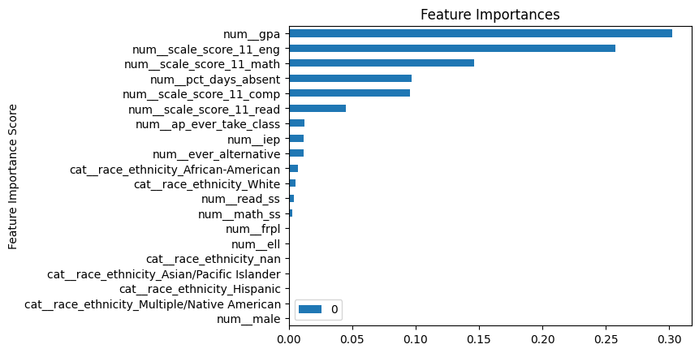

# Proof of Concept - Early Warning System

## Predictive Modeling of Earning a HS Diploma

## Overview
Currently, we employ a one-size-fits-all system for identifying at-risk students, using indicators such as attendance below 90%, the number of D's and F's in grades, and the frequency of suspensions in discipline records. However, this approach lacks specificity regarding what students are at risk of, be it graduation, college admission, or success on college placement tests.

The primary purpose of project is to leverage client data to create individualized indicators of students at-risk of not graduating.  This versatile framework which can serve as a template for predicting various outcomes whether they are continuous, binary, or multiclass.

Additionally,  the project also poduces quality metrics to enhance transparency in both the data and model used to generate the predictions.  You can access the data and model quality reports [here](https://rjw-data-poc-early-warning.streamlit.app). 

This approach is applicable to a wide range of classification problems, offering scalability for different areas seeking to incorporate predictive analytics.

## Approach

-  Data Ingestion
-  Data Transformation
-  Model Selection
-  Model Tuning
## Data Ingestion

The data comes from the Strategic Data Project in the Center of Educational Policy Research at Harvard University.  The data is sythentic and is used to test different educational analytic techniques. 

In the case of this project, the data is the form of a `.csv` file, but can be updated to directly pull from a SQL database. 

The data was loaded and variables were selected based on the revelant research of high school dropouts.  These are 16 variables and `hs_diploma` is the target variable.  

Data columns (total 16 columns):
| # |  Column               |Non-Null Count  |Dtype  
|---|  ------               |--------------  |-----  
|0  |male                  |52931 non-null  |float64
| 1   |race_ethnicity       |52257 non-null  |object 
| 2   |frpl                 |52258 non-null  |float64
| 3   |iep                  |52942 non-null  |int64  
| 4   |ell                  |52942 non-null  |int64  
| 5   |ever_alternative     |52942 non-null  |int64  
| 6   |ap_ever_take_class   |52942 non-null  |int64  
| 7   |math_ss              |43953 non-null  |float64
| 8   |read_ss              |43967 non-null  |float64
| 9   |pct_days_absent      |52855 non-null  |float64
| 10  |gpa                  |51720 non-null  |float64
| 11  |scale_score_11_eng   |43049 non-null  |float64
| 12  |scale_score_11_math  |43042 non-null  |float64
| 13  |scale_score_11_read  |43022 non-null  |float64
|14  |scale_score_11_comp  |43012 non-null  |float64
|15  |hs_diploma           |52942 non-null  |int64 

Data quality checks and exploratory data analysis were conducted to determine what transformations the data may need prior to modeling. 
## Data Transformation

Once the variables or features were analyzed, transformations were identified to deal with the following issues:
-  Class Imbalance
-  Categorical features
-  Numerical features with different scales

### Class Imbalance
Class imbalance may be a potential issue, because only 20% of records are students who did not graduate. Therefore we need to consider this in our modeling.  To account for the class imbalance, three different datasets were created to be used in modeling - 1) Imbalanced data set, Random Oversample, and Random Undersample.

### Categorical features
To deal with categorical features, we need to transform the categorical data.  To do this, we created dummy variables for all of the categorical features:
-  male
-  race_ethnicity
-  frpl
-  iep
-  ell
-  ever_alternative
-  ap_ever_take_clas

### Numerical features  

The numerical features are all on different scales, so we need to transform the data to account for differences in the scales.  To do this we transformed the data by centering and scaling the data so that all of the numerical features have a mean of 0 and standarad deviation of 1.  The numerical features are:
-  math_ss
-  read_ss
-  pct_days_absent
-  gpa
-  scale_score_11_eng
-  scale_score_11_math
-  scale_score_11_read
-  scale_score_11_comp
 
## Data Modeling
  
The type of modeling problem we have is a binary classification problem.  Classification algorithms were selected and to test against the dataset to see which classification algorithm had the best performance in terms of Accuracy, Precision and Recall.  In addition, to models we also tested different datasets to see the impact of class imbalance on the datasets.  The results of model training are below.

### Imbalanced Data  
The data is shows class imbalance of `hs_diploma` and would benefit by training models on different class imbalance approaches
### Random Oversample
In this technique, we increased the minority class, does not have `hs_diploma`, so the number of graduates equals the number of non-graduates.  
### Random Undersample
In this technique, we decreased the majority class, has `hs_diploma`, so the number of graduates equals the number of non-graduates.  

The best performing model was the XBboost.  

|Model | Accurcay | Precision | Recall
|------|----------|-----------|-------
|xgBoost	|0.906412	|0.946806	|0.938630
|Random Forest	|0.905468|	0.951916	|0.933166
|K-Nearest Neighbor|	0.872887|	0.927062	|0.917471
|Logistic Regression	|0.854755	|0.963066|	0.871741
|Support Vector Machines|	0.854377|	0.971080	|0.866066
|Decision Trees|	0.847767|	0.901742	|0.910199
|Baseline	|0.813108	|1.000000	|0.813108
|Naive Bayes|	0.749646	|0.740070	|0.939130


### Feature Importance
Feature importance was also provided from XGBoost.  The following is a rank order of importance of the features in the model:




## Model Tuning

For model tuning, we used the python package `hyperopt` which helps to identify the best parameters for your XGBoost algorithm.  

```
import xgboost as xgb
import hyperopt
from hyperopt import fmin, tpe, hp, STATUS_OK, Trials

# Define the hyperparameter space
space={'verbosity':0,
        'max_depth': hp.quniform("max_depth", 3, 18, 1),
        'gamma': hp.uniform ('gamma', 1,9),
        'reg_alpha' : hp.quniform('reg_alpha', 40,180,1),
        'reg_lambda' : hp.uniform('reg_lambda', 0,1),
        'colsample_bytree' : hp.uniform('colsample_bytree', 0.5,1),
        'min_child_weight' : hp.quniform('min_child_weight', 0, 10, 1),
        'n_estimators': 180
    }
```

The model was tuned, using the above combinations of parameters and identifed the following as the best set of parameters:
  
|Params  |Hi  
|--------|---------
|colsample_bytree | 0.705564
|gamma | 6.52894
|max_depth | 11
|min_child_weight | 7.0
|reg_alpha| 4.0
|reg_lambda | 0.0067382
|random_state | 42

This model was to create the Model Card highlight the model quality metrics.  The dashboard can be found [here](https://rjw-data-poc-early-warning.streamlit.app). Select `Model Card` as report to review the metrics.  
